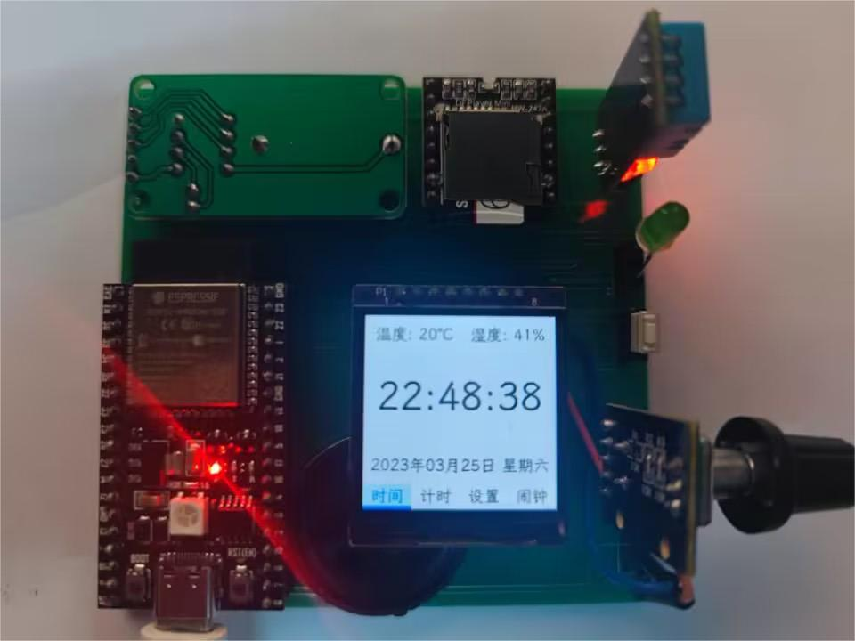

# 单片机课程设计——智能家庭时钟

## 题目要求
1. 在液晶显示屏上显示“*年*月*日 实时时间”（DS1302）;
2. 通过矩阵键盘设置时间；
3. 整点语音报时；
4. 可设多个闹钟；
5. 可以做定时器；
6. 通过温湿度传感器采集温、湿度，通过液晶屏显示温、湿度；

## 技术要点
- C/C++
- ESP32
- FreeRTOS
- Arduino
- LVGL

## 项目概括

本项目硬件部分主要使用：

- ESP32主控芯片
- TFT LCD显示屏幕
- DHT11温湿度传感器
- DS1302
- DFPlayer Mini
- 旋转编码器

本项目固件部分主要使用：

- Arduino为主要框架
- PlatformIO为开发平台
- TFT-eSPI为底层显示驱动
- LVGL为UI库等

本项目实现了题目要求的诸如：

- 实时显示时间、日期、温湿度数据信息
- 实现整点语音播报
- 实现计时与闹钟功能等

此外，我还增加了如下额外功能：

- 本项目使用LVGL绘制UI，使界面更加现代化，更具有美感，增强了用户交互体验
- 将键盘输入改为旋转编码器输入，提升了用户体验，易于上手
- 还实现了WiFi联网功能，能实时同步网络时间，以此解决单片机本地晶振计时不准的问题，省去了用户校时的麻烦
- 实现了WiFi一键配网功能，只要连接本设备WiFi，便会自动打开登陆页面，输入WiFi名称和密码，进行网络配置，方便快捷
- 增加网络指示灯，当指示灯闪烁表示正在尝试连接已有WiFi，指示灯暗表示需要配置网络，指示灯常亮表示已成功连接网络
- 增加重置按键，当用户长按后，指示灯闪烁提示，清除记忆的网络连接重新配置
- 用户可以自定义音量和屏幕亮度
- 实现温湿度数据上传手机，用户可以通过APP随时查看实时温湿度数据

## 文件结构

- /firmware 固件程序源代码
- /hardware 硬件电路相关资料
- /simulation 仿真电路图与代码
- /docs 技术文档

> 注意：仿真电路图仅功能示意，与实物效果并不一致

## 参考资料

- [超详细ESP32驱动TFT屏幕教程，有手就行_哔哩哔哩_bilibili](https://www.bilibili.com/video/BV1Q24y1d7f6/?vd_source=653c32e1b9068b6dc916bedc5c6c2c7d)
- [ESP32与微信小程序_哔哩哔哩_bilibili](https://www.bilibili.com/video/BV1tv411w74d/?p=10&spm_id_from=333.880.my_history.page.click&vd_source=653c32e1b9068b6dc916bedc5c6c2c7d)
- [Homepea7/ESP32_Code: 一些ESP32的代码 (github.com)](https://github.com/Homepea7/ESP32_Code)
- [Online font converter - TTF or WOFF fonts to C array | LVGL](https://lvgl.io/tools/fontconverter)
- [欢迎阅读百问网LVGL中文开发手册！ — 百问网LVGL中文教程文档 文档 (100ask.net)](http://lvgl.100ask.net/8.2/index.html)
- [peng-zhihui/HoloCubic: 带网络功能的伪全息透明显示桌面站 (github.com)](https://github.com/peng-zhihui/HoloCubic)
- [基于Arduino框架下的ESP32移植LVGL教程_Yogurt-994的博客-CSDN博客_esp32 lvgl](https://blog.csdn.net/qq_52619462/article/details/128294156)
- [lvgl使用旋转编码器做为外部输入设备](https://blog.csdn.net/wojueburenshu/article/details/123033471)
- [ESP32的FLASH、NVS、SPIFFS、OTA等存储分布以及启动过程](https://blog.csdn.net/tiandiren111/article/details/123144089)
- [《C++ Primer》笔记 第17章 标准库特殊设施 ](https://www.cnblogs.com/juzaizai/p/15082749.html)
- [玩转 ESP32 + Arduino (二十一) SPIFFS文件系统](https://blog.csdn.net/finedayforu/article/details/108661563)
- [ESP32通过WEB页面连接WIFI+复位重连+删除已连WiFi（Arduino）](https://blog.csdn.net/u014091490/article/details/99709431)
- [ESP32超详细学习记录：wifi配网，AP配网，浏览器配网，无线配网_喜暖知寒的博客-CSDN博客_esp32浏览器](https://blog.csdn.net/qq_41650023/article/details/124674493?spm=1001.2101.3001.6661.1&utm_medium=distribute.pc_relevant_t0.none-task-blog-2~default~CTRLIST~Rate-1-124674493-blog-99709431.pc_relevant_multi_platform_whitelistv4&depth_1-utm_source=distribute.pc_relevant_t0.none-task-blog-2~default~CTRLIST~Rate-1-124674493-blog-99709431.pc_relevant_multi_platform_whitelistv4&utm_relevant_index=1)
- [Simulate IoT Projects in Your Browser](https://wokwi.com/)
- [Arduino ESP32 ADC功能介绍以及模拟量信号读取示例](https://blog.csdn.net/weixin_42880082/article/details/121055405)
- [五、ESP32使用PWM控制蜂鸣器](https://www.qutaojiao.com/1656.html)
- [ESP32 – GPIO 引脚参考大全 – 凌顺实验室 (lingshunlab.com)](https://lingshunlab.com/book/esp32/esp32-pinout-reference)
- [Arduino运行FreeRTOS操作系统_TonyIOT的博客-CSDN博客](https://blog.csdn.net/TonyIOT/article/details/105728225)
- [创客 ESP32 Arduino 指南- Serial, Serial1, Serial2 注意事项 - 知乎 (zhihu.com)](https://zhuanlan.zhihu.com/p/79911193)
- [DFPlayer Mini 播放器模块_DFR0299_产品说明_使用教程 (dfrobot.com.cn)](https://wiki.dfrobot.com.cn/_SKU_DFR0299_DFPlayer_Mini模块#target_0)
- [Arduino学习笔记：FreeRTOS——ESP32多任务处理_esp32多线程arduino_哈哈浩丶的博客-CSDN博客](https://blog.csdn.net/weixin_45783574/article/details/123948055)
- [FreeRTOS 独立看门狗监测任务执行状态 - Crystal_Guang - 博客园 (cnblogs.com)](https://www.cnblogs.com/yangguang-it/p/7229565.html)
